# 🌌 AetherFlow

[](https://www.python.org/downloads/release/python-3110/)
[](https://www.docker.com/)
[](https://crewai.com)

**AetherFlow** is an elegant, multi-agent data orchestration system designed to validate, transform, and store data with seamless precision. By leveraging **CrewAI** agents, **Weaviate** vector search, and **Prometheus** monitoring, AetherFlow turns chaotic raw data into structured brilliance.

---

## 🏗 Architecture

```mermaid
graph TD
    User[User/API] --> API[AetherFlow API]
    API --> Redis[Redis Queue]
    Redis --> Worker[Background Worker]
    Worker --> Crew[AetherFlow Crew]
    
    subgraph Agents
        Validator[🔍 Validator Agent]
        Transformer[✨ Transformer Agent]
        Orchestrator[🎬 Orchestrator Agent]
    end
    
    Crew --> Validator
    Crew --> Transformer
    Crew --> Orchestrator
    
    Validator --> CustomTools[Pandas/SciPy Tools]
    Transformer --> CustomTools
    Orchestrator --> Weaviate[Weaviate Vector Store]
    Orchestrator --> WebSearch[DuckDuckGo Search]
    
    API --> Prometheus[Prometheus Metrics]
```



## ✨ Features
- **Multi-Agent Harmony**: Watch Validator, Transformer, and Orchestrator agents collaborate in real-time.
- **Intelligent Storage**: Metadata and quality scores are automatically indexed in Weaviate for semantic search.
- **Robust Monitoring**: Full observability with Prometheus metrics for every pipeline run.
- **Resilient Execution**: Redis-backed job queuing ensures no data is lost.

## 🚀 Getting Started

### Prerequisites
- Docker & Docker Compose
- Python 3.11+
- OpenAI & Anthropic API Keys

### Installation

1. **Clone the Repository**
   ```bash
   git clone https://github.com/saicharanrajoju/aetherflow.git
   cd aetherflow
   ```

2. **Configure Environment**
   ```bash
   cp .env.example .env
   # Edit .env with your API keys
   ```

3. **Ignite the Engine**
   ```bash
   docker-compose up --build
   ```

## 🧪 Usage Examples

### Run Example Pipeline
```bash
python example_pipeline.py
```

### API Trigger
```bash
curl -X POST http://localhost:8000/pipeline/run \
  -H "Content-Type: application/json" \
  -d '{
    "dataset_name": "sales_q4_2025",
    "source_path": "./data/sales.csv",
    "target_format": "parquet"
  }'
```

## 📊 Monitoring

Visit the **Prometheus Dashboard** at [http://localhost:9090](http://localhost:9090) to track:
- `pipeline_runs_total`
- `pipeline_duration_seconds`
- `data_quality_score`

---
